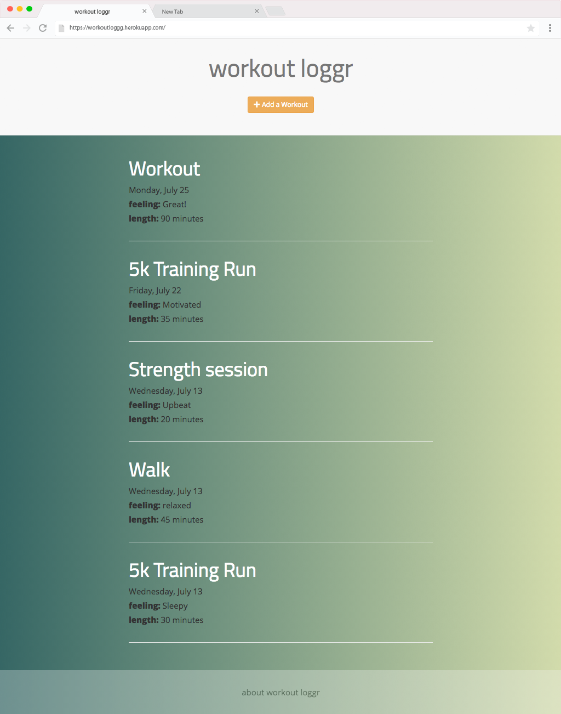
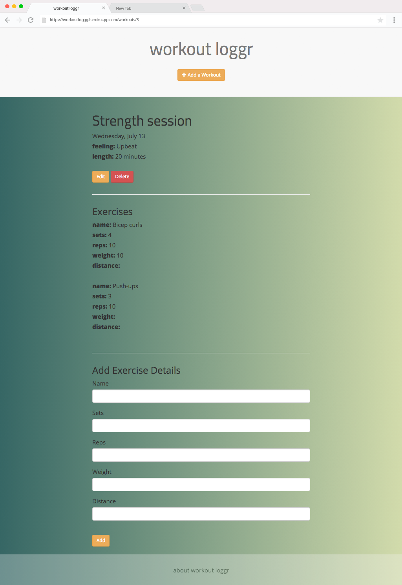

# Workout Loggr

Workout Loggr is a Ruby on Rails workout log web application. Users can log a workout for a day/time and add/edit/delete workout & exercise details.

Visit the deployed application: [https://workoutloggg.herokuapp.com/](https://workoutloggg.herokuapp.com/)

____
### Implementation Details:
* Built on Ruby on Rails framework
* PostgreSQL database
* Twitter Bootstrap 3 for CSS and UI components
* Simple Form gem for form implementation
* Responsive design

____
### Screenshot:

